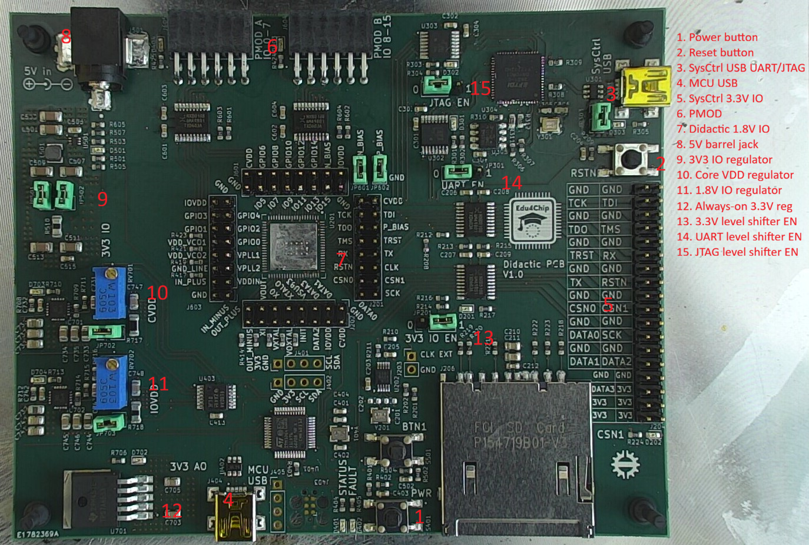
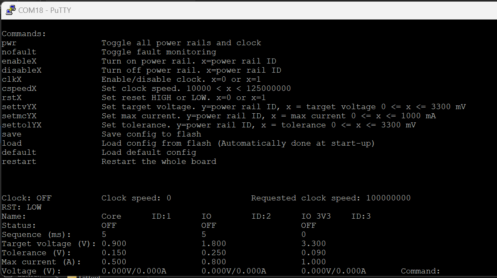

# Didactic PCB V1.0 user guide 
This repository includes design files and documentation for Didactic PCBs and software for the power management microcontroller on the PCB.

 

## Power and start-up
The Didactic PCB requires external 5V source to function. The 5V can be inserted from a 5.5 mm x 2.1 mm barrel jack or from the SysCtrl Mini-USB port. Only one of these methods should be used at once. If the barrel jack and the SysCtrl Mini-USB port are used at the same time, then JP303 should be opened to disconnect the 5V power from the Mini-USB port.

### Status LED
After 5V power has been provided to the board, an LED (D303) near the SysCtrl Mini-USB port should be lit to indicate that power is being provided. LED (D702) should also be lit to indicate that always-on 3.3 V is being regulated. Finally, the Status LED (D401) should slowly blink to indicate that the microcontroller on the board is ready, and the rest of the board can be powered by pressing the PWR button (S401). After pressing the Power button, the microcontroller will enable 3.3V IO, 1.8V IO and 0.9V Core power rails and start the clock generator and finally release the reset for the Didactic chip. Successful start-up is indicated by the STATUS LED being lit and not blinking. An LED near each power rail’s source will also be lit to indicate that the power rails are enabled. 

|STATUS LED pattern  |Pattern meaning                                        |
|--------------------|-------------------------------------------------------|
|Slowly blinking     |Board is powered, but Didactic power is off            |
|Rapid blinking      |Didactic power is on, but fault monitoring is disabled |
|Fully on            |Didactic is powered and clock enabled                  |

### Power monitoring
The power rails are always monitored for failure (Unless fault monitoring has been disabled). The power rails will fail if their voltage differs too much from the set amount or if too much current is being drawn from them. All power rails are immediately powered down if a failure is noticed in any of the power rails. Failure is indicated by blinking the Fault LED (D402). The failed power rail is indicated by the blinking pattern of the Fault LED (table 2). After power rail failure, the board can be repowered by pressing the PWR button.

|Fault LED blink count|Failed power rail |
|---------------------|------------------|
|1                    |Core              |
|2                    |IO                |
|3                    |3.3V IO           |

### Votage adjustment
Voltage of IO and Core power rails can be adjusted with trimmers RV702 and RV701. It is recomended to disable power rail fault checking while adjusting the voltages and set new target voltages for each power rail after adjustment. More information about this can be found under the power monitor MCU section.

If needed, the power regulators can be disconnected from the power rails by removing the jumpers near them (JP703, JP702, JP501 and JP502). This may be needed aduring the first bring-up process for each PCB as the power rail voltages may be set incorrectly. If the Didactic chip is assembled on the PCB before bring-up, the power regulators must be disconnected and adjusted. 

## IO
### SysCtrl 3.3V IO
All SysCtrl IOs are level shifted to 3.3V and available on header J204. The signals are level shifted using bidirectional auto direction sensing level shifters. The level shifters must be enabled using the 3V3 IO EN jumper. Because of a design mistake, the level shifters are enabled when the jumper is set to 0 and disabled when the jumper is set to 1. LED D201 near the jumper will indicate when the level shifters are enabled. Level shifted SPI signals are also connected to an SD card socket.

JTAG and UART signals are also level shifted using separate unidirectional level shifters and connected to FT2232HQ USB converter. These level shifters can be enabled with UART EN (JP301) and JTAG EN (JP302) jumpers. Pinout for the FT2232HQ is shown below.

|FT2232HQ pin   |Net              |
|---------------|-----------------|
|ADBUS0         |TCK              |
|ADBUS1         |TDI              |
|ADBUS2         |TDO              |
|ADBUS3         |TMS              |
|BDBUS0         |TX (Didactic RX) |
|BDBUS1         |RX (Didactic TX) |

### Didactic 1.8V IO
All Didactic 1.8V IO is directly accessible on pin headers J201, J202, J601 and J603. All analog pins 32-50 of Didactic are connected to ground using 0-ohm resistors. N BIAS and P BIAS are connected to ground using JP601 and JP602 jumpers.

### PMOD
GPIO signals 0-15 of the Didactic are connected to two PMOD (PMOD A and PMODB) connectors and level shifted to 3.3V using bidirectional auto direction sensing level shifters. These level sifters are always enabled. PMOD connector IO signal pinouts are shown below.

PMOD A pinoout:
|Didactic    |PMOD A      |
|------------|------------|
|GPIO0       |IO1         |
|GPIO1       |IO2         |
|GPIO2       |IO3         |
|GPIO3       |IO4         |
|GPIO4       |IO5         |
|GPIO5       |IO6         |
|GPIO6       |IO7         |
|GPIO7       |IO8         |

PMOD B pinoout:
|Didactic    |PMOD B      |
|------------|------------|
|GPIO8       |IO1         |
|GPIO9       |IO2         |
|GPIO10      |IO3         |
|GPIO11      |IO4         |
|GPIO12      |IO5         |
|GPIO13      |IO6         |
|GPIO14      |IO7         |
|GPIO15      |IO8         |

## Power monitor MCU
Microcontroller on the board is used to monitor and sequence the power rails and control the clock generator. The Didactic can be started by pressing the PWR button or the start-up process can be controlled using the microcontrollers virtual COM port. The COM port can be accessed by connecting a Mini-USB cable to the MCU USB port.

### Virtual COM port
Any virtual terminal software can be used to connect to Virtual COM port. Baud rate can also be freely chosen.

The microcontroller will continuously print the voltage and current of all the power rails. The virtual terminal window should be made big enough so that a full line of text can fit without line changes. Commands can be typed into the virtual terminal, and all commands must be ended by pressing enter. Pressing enter will also always reprint the command list. Configuration for all power rails is shown at the bottom of the terminal and the bottom most line is updated three times a second and it shows the current voltage and power consumption of the power rails.

### Commands
Power rails and the clock can be controlled by writing commands to the virtual terminal. All supported commands are shown below.

|Command          |Parameters                             |Explanation                                                                                                                              |
|-----------------|---------------------------------------|-----------------------------------------------------------------------------------------------------------------------------------------|
|pwr              |                                       |Turns on/off all the power rails and clock. Same as pressing the PWR button                                                              |
|nofault          |                                       |Disables/enables fault checking for all power rails. Status LED will blink quickly when power is enabled, and fault checking is disabled |
|enableX          |X = power rail ID                      |Enabled power rail*                                                                                                                      |
|disableX         |X = power rail ID                      |Disable power rail*                                                                                                                      |
|clkX             |X = 0 or X = 1                         |Enabled or disable clock. 1 = enable                                                                                                     |
|cspeed           |10000 < X < 125000000                  |Set requested clock speed. clk1 command must be sent after this command to enable clock with requested speed                             |
|rstX             |X = 0 or X = 1                         |Set Didactic reset LOW or HIGH, LOW = reset                                                                                              |
|settvYX          |Y = power rail ID, 0 mV <= X <= 3300 mV|Set power rail’s target voltage                                                                                                          |
|setmcYX          |Y = power rail ID, 0 mA <= X <= 1000 mA|Set power rail’s maximum current                                                                                                         |
|settolYX         |Y = power rail ID, 0 mV <= X <= 3300 mV|Set power rail’s tolerance to voltage difference between target and actual voltage                                                       |
|save             |                                       |Save current config to Flash                                                                                                             |
|load             |                                       |Load config from flash                                                                                                                   |
|default          |                                       |Load default config                                                                                                                      |
|restart          |                                       |Shutdown all power rails and restart the MCU                                                                                             |

*IO and Core power rails source their power from 3.3V IO power rails, so they cannot be powered before 3.3V IO power rails. IO and Core can be enabled before 3.3V IO power rails but they will be powered only after 3.3V IO has been powered. 

### Programming
The microcontroller can be programmed using ST-LINK debugger using SWD interface. This can be done using 4-pin pin header (J405) or 6-pin TC2030 Tag-Connect cable.